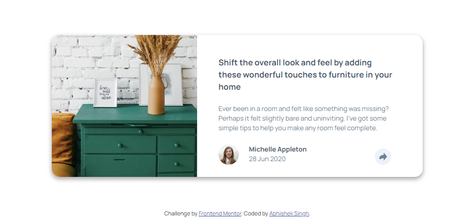
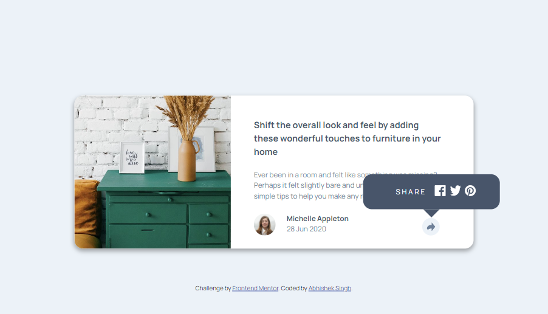
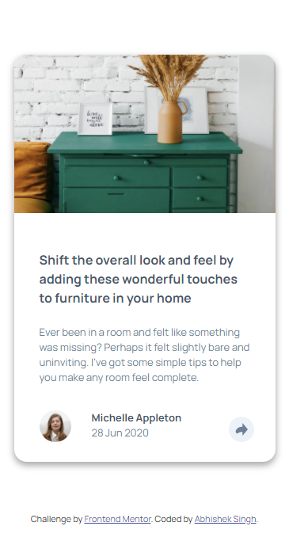
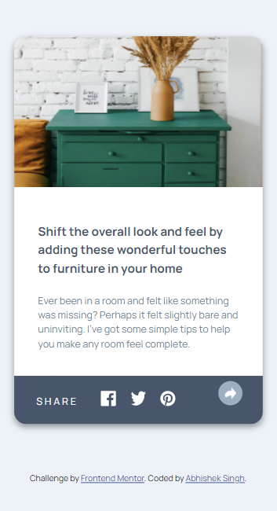

# Frontend Mentor - Article preview component solution

This is a solution to the [Article preview component challenge on Frontend Mentor](https://www.frontendmentor.io/challenges/article-preview-component-dYBN_pYFT). Frontend Mentor challenges help you improve your coding skills by building realistic projects. 

## Table of contents

- [Overview](#overview)
  - [The challenge](#the-challenge)
  - [Screenshot](#screenshot)
  - [Links](#links)
- [My process](#my-process)
  - [Built with](#built-with)
  - [What I learned](#what-i-learned)
  - [Continued development](#continued-development)
  - [Useful resources](#useful-resources)
- [Author](#author)

## Overview

### The challenge

Users should be able to:

- View the optimal layout for the component depending on their device's screen size
- See the social media share links when they click the share icon

### Screenshot

-Desktop/Desktop(Active)

-Mobile/Mobile(active)

### Links

- Solution URL: [Github Repository](https://github.com/abhisheksinghwork7/Article-preview-component)
- Live Site URL: [Vercel App](https://article-preview-component-lake-alpha.vercel.app/)

## My process

### Built with

- Semantic HTML5 markup
- CSS custom properties
- Flexbox
- Mobile-first workflow

### What I learned

During this project, major emphasis was on Flexbox and how I can cusomise the componenets of the page using flex properties. Flex-basis came to my help when setting the width for various components.

Also, my first try at JS for making a functionality. The click functionality was added by defining a class and then adding it on clicking. 

Creating an arrow out of the box was another trick that I used on this project. We can see that once we click on thew desktop site.

### Continued development

I need to standardize my naming conventions for the class on HTML and writing the css codes so that it is more readable.

## Author

- Frontend Mentor - [@abhisheksingh7](https://www.frontendmentor.io/profile/abhisheksinghwork7)
